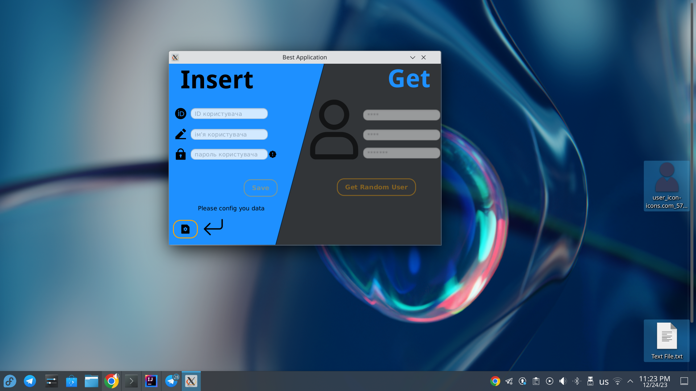
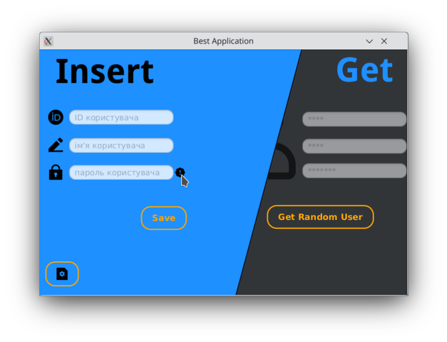
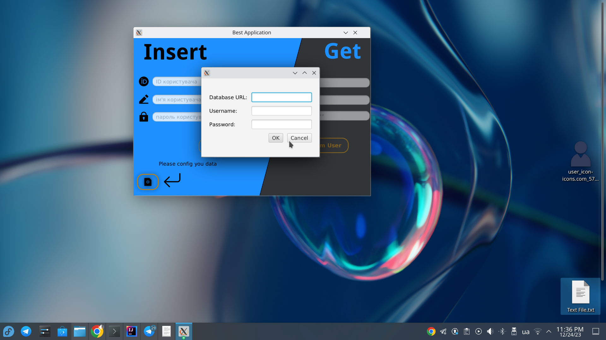

🎉 Вітаю в проекті "Керування користувачами JavaFX"! 🎉

## 🚀 Загальний огляд

Цей `README.md` файл призначений для надання інструкцій та інформації про ваш JavaFX додаток, який дозволяє керувати даними користувачів. Використовуйте його як посібник для налаштування, використання та внесення вкладу у ваш проект.


---

## Вступ

Цей додаток створений з метою надання зручного інтерфейсу для введення та збереження даних користувачів у базу даних, а також для виведення інформації про рандомного користувача.

---

## Функціональність

✨ **Головне вікно**:
- Зліва ми можемо бачити Три текстові поля для введення ID, імені та паролю користувача.
  як було вказано в завданні поле паролю валідується, для зручності користування, було доданна підсказка при наведенні на значок інформації поруч з полем(тултіп)
  
  
 **Анімації для преміальності**:
- було додано небагато анімацій, для покращення вигляду додатку, одна з таких, це "вибір сторони" - коли ти наводиш на одну з сторін, вона в свою чергу розширяється для кращого вигляду
  

**Конфігурація бази данних**:
  - конфігурація відбувається прямо в додатку тим самих полугшуючи використання, просто натисніть кнопку зліва внизу, і введіть данні, і все) 
    
  - база данних повинна мати таблицю такого виду
    
```bash
    CREATE TABLE users (
        id INT PRIMARY KEY,
        name VARCHAR(100) NOT NULL,
        password VARCHAR(100) NOT NULL
    ); 
```

- додаю також спеціальну базу для тестів
```bash
database.url=jdbc:mysql://db4free.net:3306/mytestdb_jester
database.user=jester2204
database.password=qwerty123456
```